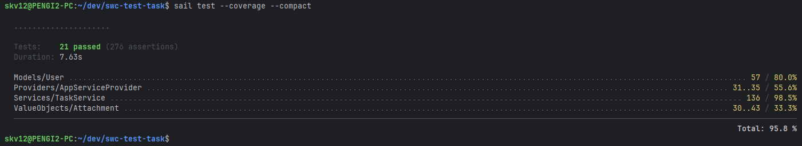

# Тестовое задание для SWC

Задание выполнено с использованием `laravel/sail`. В качестве токен-авторизации использован `laravel/sanctum` для минимизации зависимостей.
Решил с минимумом зависимостей.

### Инфраструктурные зависимости
- Docker
- Postgres
- Redis (Для очередей)
- Mailpit (только для тестирования почты)

### Установка
- Склонировать репозиторий
- Выполнить команду/команды
  - Если есть CMake (скачивание зависимостей, билд контейнера Laravel Sail и запуск контейнеров)
    ```shell
    make setup
    ```
  - Если нет
    ```shell
    composer min-setup
    ```
    ```shell
    ./vendor/bin/sail up -d
    ```

### Запуск очередей
Для корректной работы отправки почты, выполните команду 
```shell
./vendor/bin/sail artisan queue:work
```

### OpenApi
Для получения документации, откройте страницу `http://localhost/docs/api`

Использован автогенератор документации `dedoc/scramble`

### Тесты
Для запуска тестов выполните команду
```shell
make test
```
или
```shell
./vendor/bin/sail test
```



Для проверки почты используйте Mailpit, откройте по ссылке http://localhost:8025/. 
При автотестах почта туда не отправляется, `MailManager` в тестах мокается.
Проверяйте через Postman или через http://localhost/docs/api
